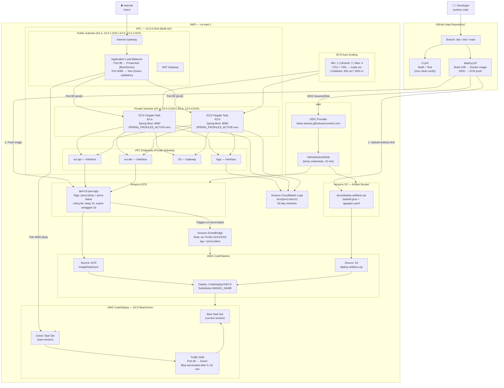
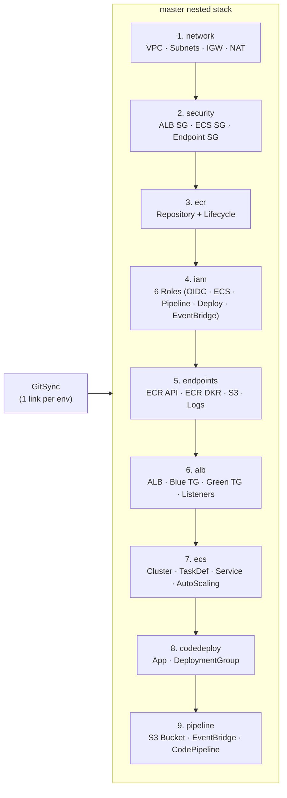
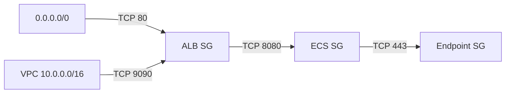
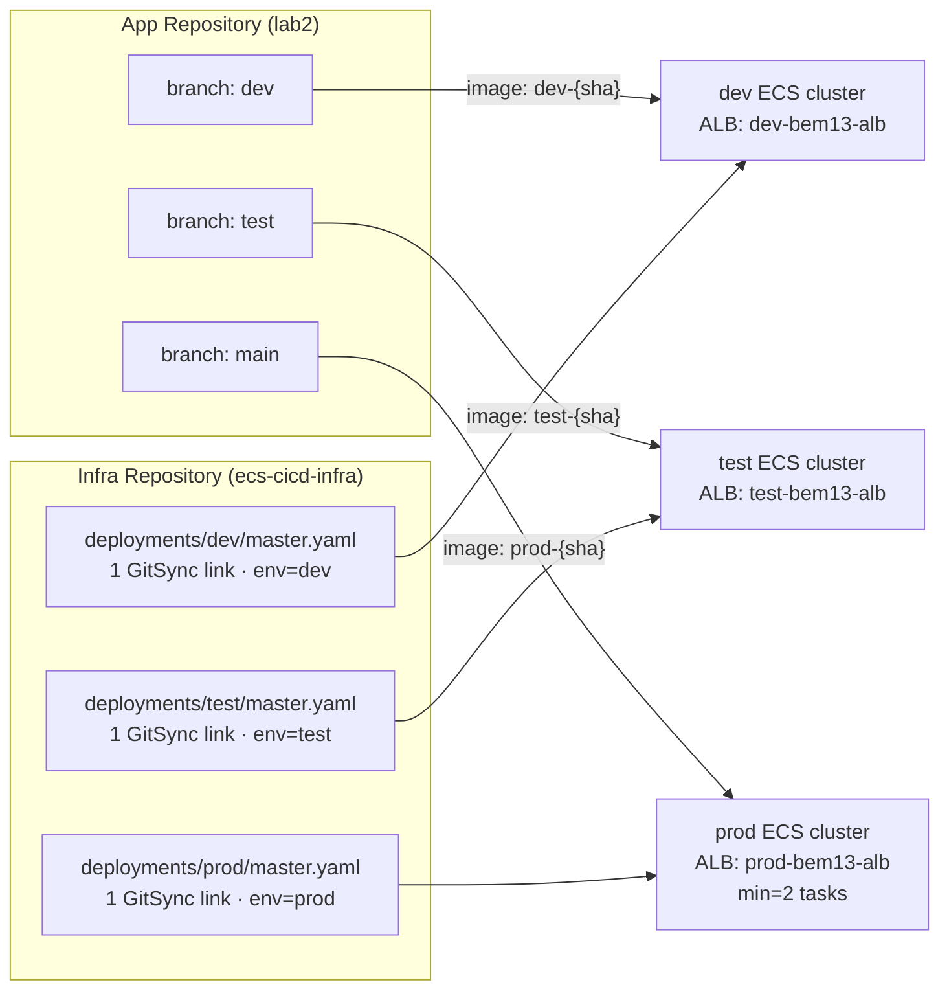

# BEM13 ECS CICD — Network Architecture Diagram

Author: Timothy Nlenjibi | Lab: BEM13 Running Containers on AWS

---

## Full System Architecture

---

## CloudFormation Stack Dependency Chain

One GitSync link per environment deploys a single master nested stack,
which creates all 9 child stacks in order via `DependsOn`.

> Child templates must be uploaded to S3 before deploying the master stack:
> `aws s3 sync templates/ s3://YOUR-BUCKET/ecs-cicd-infra/templates/`

---

## Security Group Rules

---

## Three-Environment Deployment Model

